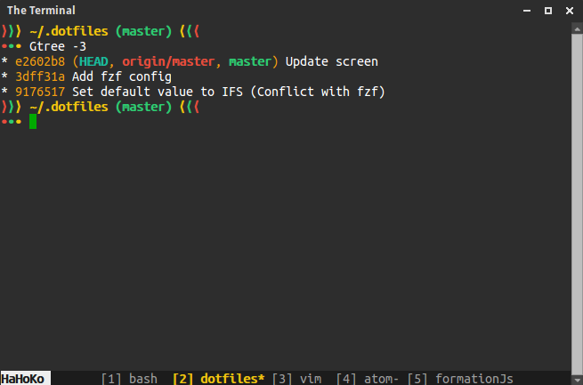

MyDotFiles
==========

This repository contains dotfiles and configuration files that I'm using on my GNU/Linux systems plus some scripts for app & packages installation.

<div style="text-align:center"></div>

Content
-------

- agignore
- bash (rc, profile, aliases, functions...)
- ctags
- git:
  * gitconfig
  * A global gitignore
- quicktile.cfg
- Script for displaying git branch name in the prompt.
- tmux.conf
- CLI & graphical applications:
  * xfce4-terminal: terminal.rc
  * zathura: zathurarc
  * tudu: tudurc
- Installation scripts:
  * Nodejs modules (From `install/npm/packages.txt`)
  * Pip packages (From `install/pip/packages.txt`)

Usage
-----

### Dotfiles

First specify parameters in the `do.sh` script:

1- `dotfiles_folder` variable.

2- Symbolic links to create using the following syntax:

```
createLink relative/path/to/file /absolute/path/to/link [h(if hidden file)]
```

3- Where and what files need to be copied.

```
    copyFile relative/path/to/file /absolute/path/to/destination [h(if hidden file)]
```

Then simply execute the script in a terminal to have a visible output.

### Installation script

Create a script in `install/` (*Ex.* `apt/apt.sh`) who need a password variable as 1st parameter, then add it to `install.sh`:

```
sourceFile 'apt\apt.sh' $pass &&	 #pass exists already in install.sh
```

Now, execute `install.sh` to have a visible output.
