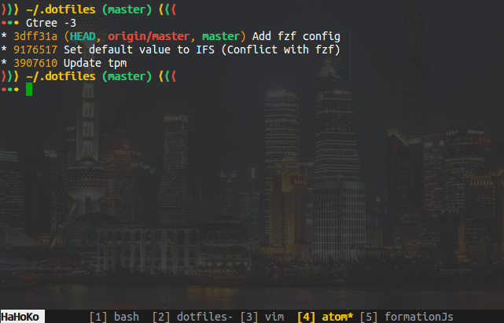

MyDotFiles
==========

This repository contains some important dotfiles that I use in my GNU/Linux systems and a bash script for automatiion process.

Content
-------

As for now it contains:

- For bash:
    * Bashrc
    * Aliases
    * Functions.
    * Script for displaying git branch name in the prompt.

- For tmux:
    * tmux.conf

- For Stjerm:
    * Xdefaults.cfg

- For Xfce4-terminal
    * terminal.rc

- Other files:
    * quicktile.cfg
    * gitconfig
    * ctags

Usage
-----

In the beginning, specify your parameters in the **do.sh** script:

1- *dotfiles_folder* variable.

2- Symbolic links to create using the following syntax:

    createLink relative/path/to/file /absolute/path/to/link [h(if hidden file)]

3- Where and what files need to be copied.

    copyFile relative/path/to/file /absolute/path/to/destination [h(if hidden file)]

Then simply execute the script in a terminal to have a visible output.
