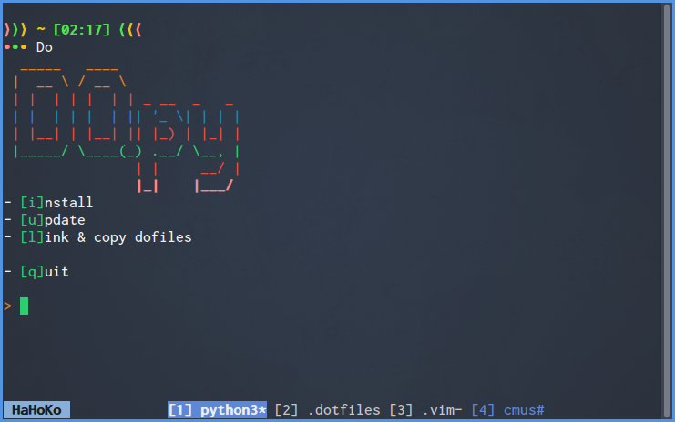

MyDotFiles
==========

My **GNU/Linux** main repository with:

- Dot & configuration files for many different apps
- Scripts for linking dotfiles, system installation and updating.



*N.B: This repo is frequently updated*

Content
-------

```
├── ag
│   └── agignore
├── bash
│   ├── functions
│   │   └── bash_example
│   ├── fzf
│   │   └── functions.sh
│   ├── bash_aliases
│   ├── bash_functions
│   ├── bash_profile
│   ├── bashrc
│   └── profile
├── cmus
│   └── rc
├── ctags
│   └── ctags
├── dunst
│   └── dunstrc
├── git
│   ├── gitconfig
│   └── gitignore_global
├── i3
│   ├── blocks
│   │   ├── cmus
│   │   ├── layout
│   │   ├── menu
│   │   ├── time_and_date
│   │   └── volume
│   ├── config
│   ├── exit.sh
│   ├── i3bar_conkyrc
│   └── i3blocks_primary.conf
├── install
│   ├── scripts
│   │   ├── arc.sh
│   │   ├── blink.sh
│   │   ├── calibre.sh
│   │   ├── github_repos.sh
│   │   ├── i3.sh
│   │   ├── mkvtoolnix.sh
│   │   ├── nodejs.sh
│   │   ├── rvm.sh
│   │   └── topmenu.sh
│   ├── apt.json
│   ├── packages.json
│   └── scripts.json
├── quicktile
│   └── quicktile.cfg
├── shiba
│   └── config.yml
├── tmux
│   ├── plugins
│   │   └── tpm
│   └── tmux.conf
├── tudu
│   └── tudurc
├── X
│   ├── xmodmaprc
│   └── Xresources
├── xfce4-terminal
│   └── terminalrc
├── zathura
│   └── zathurarc
├── install.py
├── link.sh
├── update.py
└── update_scripts.sh
```

Usage of scripts
----------------

No arguments needed here, simply execute a script to get a visible output.

### link.sh

Create, link & copy configuration files to adequate places.

First specify parameters:

1. `dotfiles_folder` variable.

2. Direcory(ies) to create if they does not exist:

  ```sh
  makeDir path/to/dir &&
  ```

3. Symbolic links to create using the following syntax:

  ```sh
  createLink relative/path/to/file /absolute/path/to/link [h(if hidden file)] &&
  ```

4. Where and what files need to be copied.

  ```sh
  copyFile relative/path/to/file /absolute/path/to/destination [h(if hidden file)] &&
  ```

### update_scripts.sh

Update all git repositories defined in the variable `proj_dirs`.

### install.py

Use it to install all packages, ppa's and needed applications

**P.S:** The packages present in `install/apt.json` are intended to be used on `Xubuntu16`.

### update.py

Update all the system and the git repos defined in `update_scripts.sh`.

TODO
----

- Convert remaining scripts to python.
- Use a home-made sh/python framework to prevent code duplication.
- More refactoring when I'll have time.
